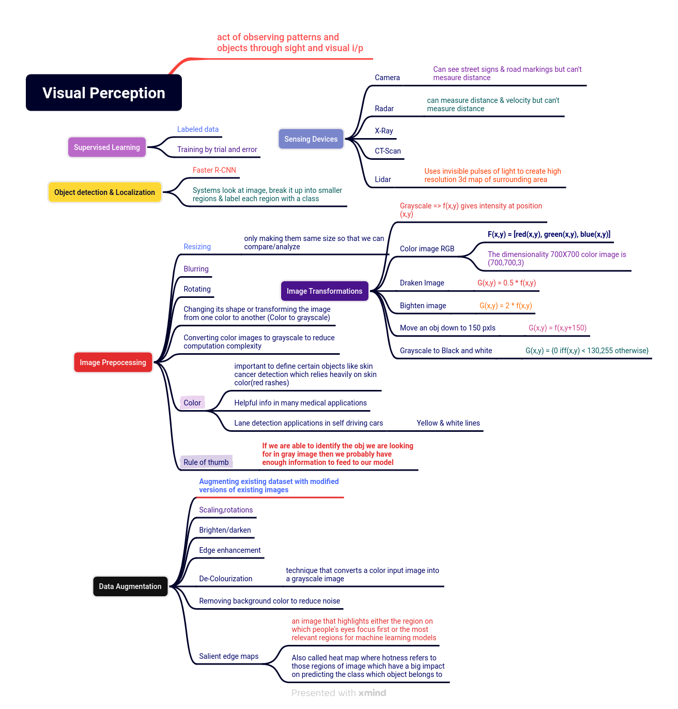
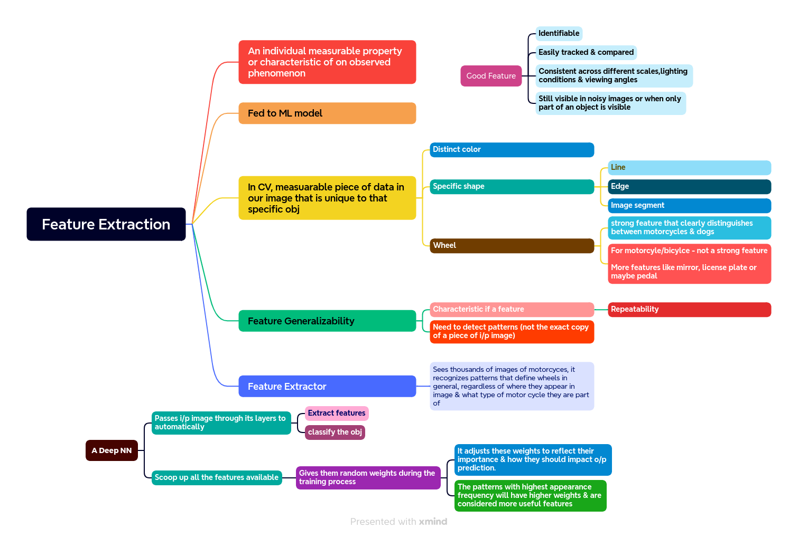
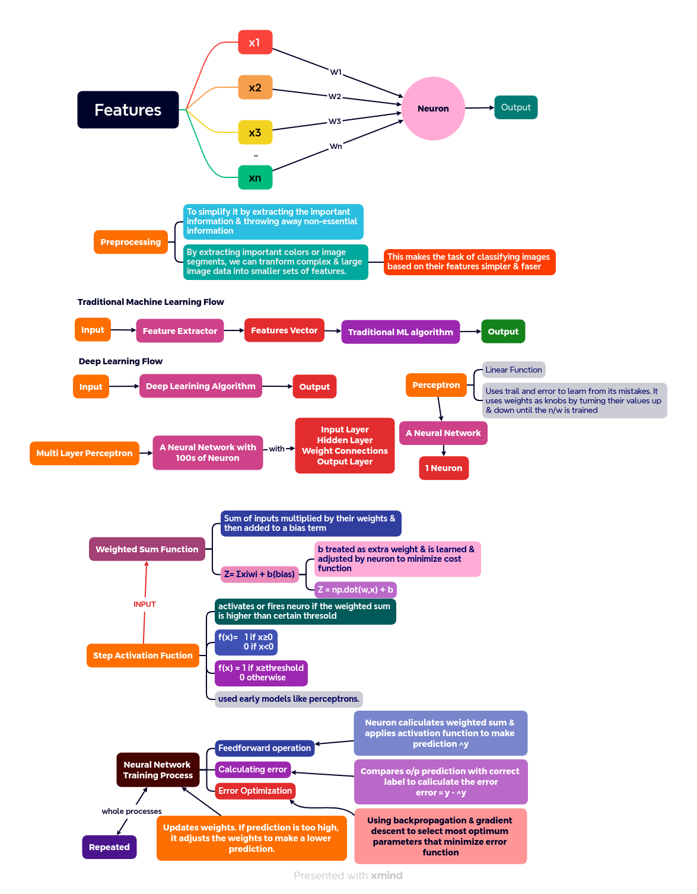
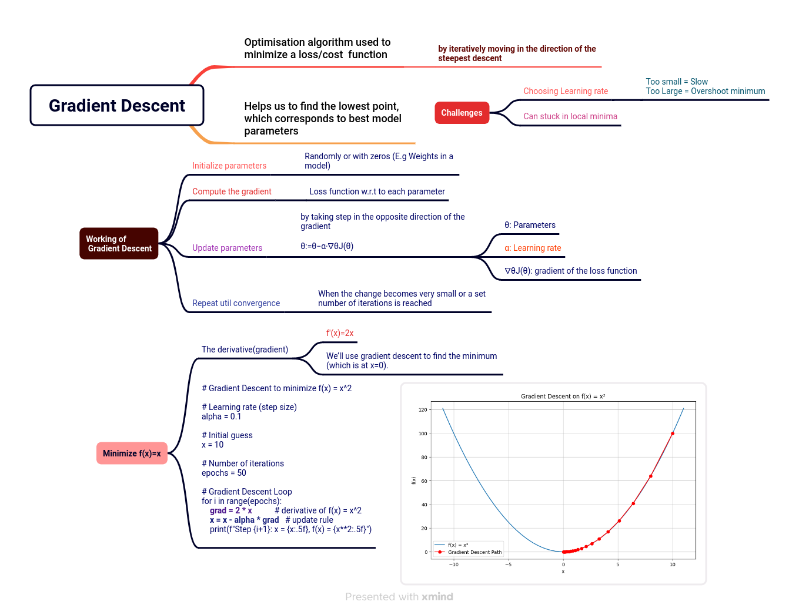

# Deep Learning

The Neural Network training process is repeated many times, neurons continue to update the weights to improve the prediction until error caliculation step produces a very small error(close to zero), which means neurons prediction is very close to correct value.At this point, we can stop the training & save weight values that yielded the best results to apply to future cases where outcome is unknown.

