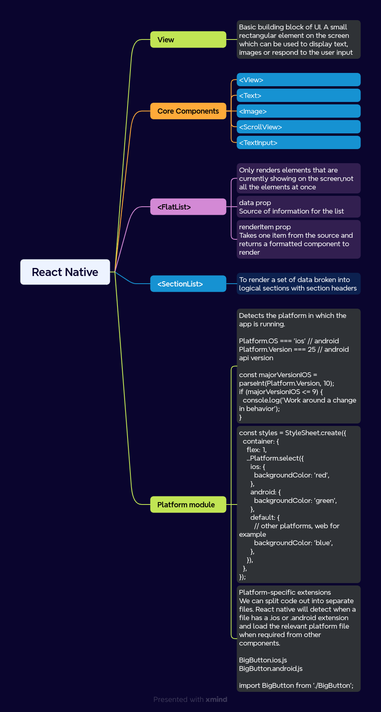

### Setting up the Environment

#### Adding VSCODE extension

* React Native Tools

* open VSCODE and press (Ctrl + P)

    ```
    ext install msjsdiag.vscode-react-native
    ```
* Expo React Framework

  - Production-grade React Native Framework which provides developer tooling that makes developing apps easier, such as file based routing, a standard library of native modules and much more

  - Creating the project

    ```
    npx create-expo-app@latest
    ```
  - Starting development server

    ```
    npx expo start
    ```

  - Folder structure

    - app
        - Contains apps navigation which is file based
    - assets
    - components
    - constants
    - hooks
    - scripts
    - app.json
    - package.json
    - tsconfig.json

- Reset your project
    - To remove boilerplate code and start fresh with new project.
    ```
    npm run reset-project
    ```

### About



### Development Using Expo [Reference](https://docs.expo.dev/tutorial/introduction/)

* **app/index.tsx** 
  - Defines the apps screen.
  - Entry point of our app
  - Donot need path segment
  - matches / route

* **app/_layout.tsx**

  - Root Layout
  - Defines shared UI elements such as headers and tab bars so they are consistent between different routes

####  Styling the app the same as react

```
<View style={{
  flex:1,alignItems:'center'
}}>

</View>

```
####  Using StyleSheet from 'react-native'

```
const styles = StyleSheet.create({
  container: {
    flex: 1,
    backgroundColor: '#25292e',
    alignItems: 'center',
    justifyContent: 'center',
  },
  text: {
    color: '#fff',
  },
});

<View style={styles.container}>

</View>
```

####  Stack navigator is foundation for navigating between different screens in an app

```
// app/_layout.tsx

import { Stack } from 'expo-router';

export default function RootLayout() {
  return (
    <Stack>
      <Stack.Screen name="index" options={{ title: 'Home' }} />
      <Stack.Screen name="about" options={{ title: 'About' }} />
    </Stack>
  );
}

```
#### Link component is used to navigate 

```
import { Link } from 'expo-router';

<Link href='about' styles={styles.button}>
Go to About Screen
</Link>
```
#### not-found route

* app/+not-found.tsx (Filename) 
* To display a fallback screen, matches route any 404 route

```
 return (
    <>
      <Stack.Screen options={{ title: 'Oops! Not Found' }} />
      <View style={styles.container}>
        <Link href="/" style={styles.button}>
          Go back to Home screen!
        </Link>
      </View>
    </>
  );
```

#### Tabs in the bottom of the screen like X app

* app/_layout.tsx

```
import { Stack } from 'expo-router';

export default function RootLayout() {
  return (
    <Stack>
      <Stack.Screen name="(tabs)" options={{ headerShown: false }} />
    </Stack>
  );
}
```

* app/(tabs)/_layout.tsx

```
import { Tabs } from 'expo-router';

export default function TabLayout() {
  return (
    <Tabs>
      <Tabs.Screen name="index" options={{ title: 'Home' }} />
      <Tabs.Screen name="about" options={{ title: 'About' }} />
    </Tabs>
  );
}

```
Applying the styling

```
import { Tabs } from 'expo-router';

import Ionicons from '@expo/vector-icons/Ionicons';


export default function TabLayout() {
  return (
    <Tabs
      screenOptions={{
        tabBarActiveTintColor: '#ffd33d',
        headerStyle: {
          backgroundColor: '#25292e',
        },
        headerShadowVisible: false,
        headerTintColor: '#fff',
        tabBarStyle: {
          backgroundColor: '#25292e',
        },
      }}
    >
      <Tabs.Screen
        name="index"
        options={{
          title: 'Home',
          tabBarIcon: ({ color, focused }) => (
            <Ionicons name={focused ? 'home-sharp' : 'home-outline'} color={color} size={24} />
          ),
        }}
      />
      <Tabs.Screen
        name="about"
        options={{
          title: 'About',
          tabBarIcon: ({ color, focused }) => (
            <Ionicons name={focused ? 'information-circle' : 'information-circle-outline'} color={color} size={24}/>
          ),
        }}
      />
    </Tabs>
  );
}

```